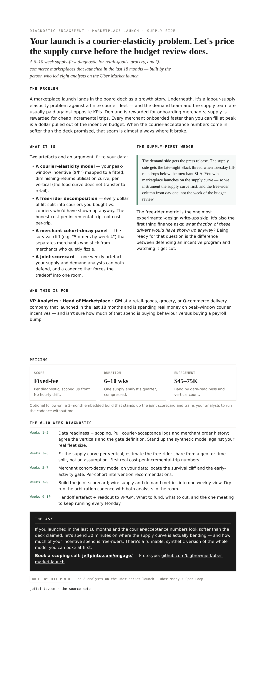

# uber-market-launch

**The free-rider calculator I wished I'd had in 2019.**

A synthetic courier supply-elasticity simulator plus a merchant cohort-decay panel — the two artefacts a marketplace launch actually turns on, with the free-rider decomposition finance always eventually asks about. Turn the incentive knob and watch the free-rider share move.

## Demo

Open [`sim.html`](./sim.html) in any browser — double-clicking the file works. It's a single self-contained HTML file: no server, no build step, no network calls. Synthetic model only — no Uber data.

## What else is here

- [`one-pager.html`](./one-pager.html) — the engagement sheet (one Letter page; preview below).
- [`note.html`](./note.html) — the long-form note, rendered for the fleet bundle (its stylesheet lives in the parent bundle, so it opens unstyled here; the canonical version is the source note below).

## Data

Everything in this repo is synthetic or public — no client data, no real metrics, no PII. See [`PRIVACY.md`](./PRIVACY.md).

## Source

The thinking behind this prototype: https://jeffpinto.com/notes/uber-market-launch/

## License

MIT — © 2026 Jeff Pinto.

Built by Jeff Pinto · advisory: https://jeffpinto.com/engage/
